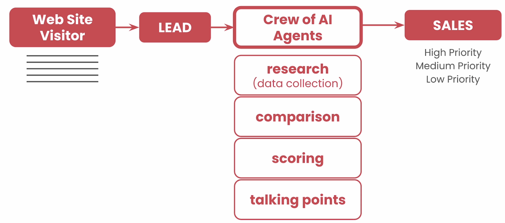

Generic Approach for Data Collection and Analysis:

Outsmarting generic approaches using Agents

Agents we would we dealing with:
1. Tech Job Researcher
2. Personal Profiler
3. Resume Strategist
4. Interview Preparation Expert

Steps to take:
- Search the internet
- Read websites
- Read resume
- Perform RAG on resume

---
## 1: AI Agents

* **Definition:** Used to augment language models' capabilities beyond text generation, enabling them to interact with external tools and perform complex tasks.
* **Structure:** Often consist of:
    * LLM: The "brain" for understanding and generating language.
    * Tools: External functionalities the agent can access (e.g., calculators, search engines).
    * Memory: Stores information from past interactions.
    * Planner: Decides which actions to take based on the current situation and goal.

**Multi-Agents:**

* **Definition:** Allows for more specialized agents working together, each with specific expertise (e.g., one for information retrieval, another for summarization), these agents can also be based on diffrent LLMs. 
* **Benefits:**
    * Improved efficiency and scalability.
    * Increased robustness and adaptability to complex problems.
    * Potential for emergent behavior and collective intelligence.

**Working Principle:**

1. **Perception:** Agents receive input from their environment (e.g., user query, context, tools).
2. **Reasoning:**  LLM processes input, utilizes memory, and potentially consults other agents to formulate a plan.
3. **Action:** Agent executes actions based on the plan (e.g., generate text, call a tool, communicate with another agent).
4. **Feedback:** Agent observes the results of its actions and updates its knowledge or strategy accordingly.

**Challenges:**

* **Coordination:** Designing effective communication and coordination mechanisms between agents.
* **Scalability:**  Managing the complexity of large-scale multi-agent systems.
* **Evaluation:** Measuring the performance and effectiveness of multi-agent systems.
* **Alignment:** Ensuring agents' goals align with human values and safety concerns.

---
## 2: Agents does the research and writes article for you. 

This script sets up a system to automate the creation of blog articles using AI agents. It begins by installing necessary libraries and configuring the environment with an OpenAI API key. Three agents are defined: a Planner, a Writer, and an Editor, each with specific roles, goals, and backstories to enhance the performance of Large Language Models (LLMs) through role-playing. Tasks are then created for each agent, detailing the steps and expected outputs for planning, writing, and editing a blog post on a given topic. Finally, a Crew is assembled to manage the sequence of tasks, ensuring they are executed in the correct order, and the process is initiated with a specific topic input, generating a blog post on "Transformers and Attention in LLMs".

---
## 3. Key Elements in Agent

AI Agent Characteristics:

| Characteristic | Description                                                                                                  | Importance                                                                                                                                      | Example in CrewAI |
|----------------|--------------------------------------------------------------------------------------------------------------|-------------------------------------------------------------------------------------------------------------------------------------------------|-------------------|
| **Role Playing**    | Defining the agent's persona, goals, and backstory to guide its behavior and responses.                           | Helps agents produce specific, contextually appropriate outcomes; enables better control over agent behavior.                                   | Using keywords like "FINRA approved financial analyst" to achieve better financial analysis than "finacial analyst" alone. |
| **Focus**          | Limiting the agent's scope in terms of tools, information, and context to prevent information overload and hallucinations. | Ensures agents stay on task and produce accurate results, especially important for smaller models with limited capacity.                       | Multiple specialized agents instead of one generalist agent. |
| **Tools**          | Providing agents with the right tools for their tasks, avoiding overwhelming them with unnecessary options.            | Ensures agents have the necessary resources to perform their tasks effectively and efficiently.                                                | Giving an agent access to a calculator for mathematical tasks. |
| **Cooperation**   | Enabling agents to collaborate, share feedback, and delegate tasks.                                               | Leads to better outcomes through shared context, feedback, and task delegation.                                                               | Agents sharing learnings in a shared short-term memory during crew execution. |
| **Guardrails**      | Implementing safeguards to prevent hallucinations, loops, and other undesirable behaviors.                      | Ensures reliability, consistency, and safety in AI applications by preventing errors and keeping agents on track.                                 | Preventing agents from repeatedly using the same tool. |
| **Memory**         | The ability of agents to remember past actions, learn from them, and apply knowledge to future tasks.               | Significantly improves agent reliability and enables continuous improvement of outcomes over time.                                            | Short-term, long-term, and entity memory types in CrewAI. |

---
## 4. THings to keep in mind while working with Agents

## 5. Tools

Versatile:

Fault-Tolerant:

Caching:

**Key Points about Tools in Multi-Agent Systems:**

* **Tools:** Allow AI agents to interact with the external world (APIs, databases, notifications, etc.).
* **Importance:** Crucial for real-world impact and application of multi-agent systems.
* **Qualities of Great Tools:**
    * Versatile: Handle diverse requests from LLMs.
    * Fault-tolerant: Fail gracefully without stopping execution.
    * Caching: Prevent unnecessary requests and save time/resources.
* **CrewAI Tools:**
    * Versatile, fault-tolerant, and implement smart caching.
    * Offers documentation for existing tools.
    * Supports LangChain tools for broader functionality.

**Key Takeaways:**

* Tools are a cornerstone of multi-agent systems.
* Choose tools mindfully, balancing capabilities with the agent's needs.
* Consider versatility, fault tolerance, and caching when building custom tools.
* Explore existing tool documentation for efficient development.

**Some important tools:**
Google Serper Search 
CSV RAG Search
Scrape Website
XML RAG Search
Directory Read
JSON RAG Search
File Read
Docx Rag Search
Selenium Scraper
MDX RAG Search
Directory RAG Search 
PG RAG Search
PDF RAG Search
Website RAG Search
TXT RAG Search
Github RAG Search
Code Docs RAG Search
Youtube Video RAG Youtube
Channel RAG Search